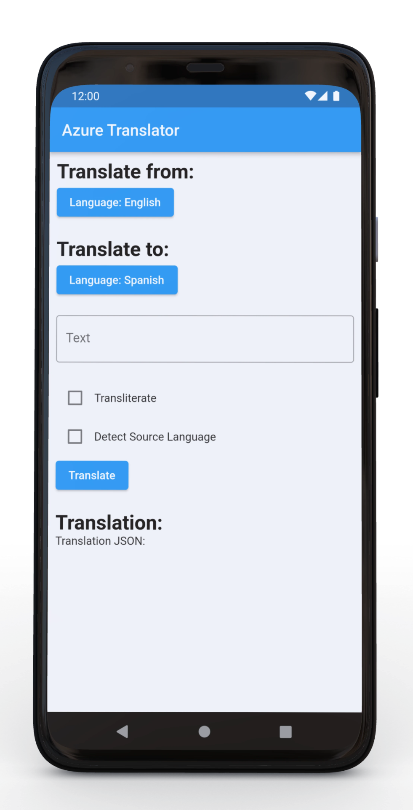

# Flutter and Azure Cognitive Services - Translator

Translate strings with Azure Cognitive Services

## [Blog Post](https://adamsotak.com/blog/flutter-azure-translator)

The application sends HTTP requests to a Node.js Express app hosted on Azure App Service. The Express app relays the request to the Azure Translator service and sends back the translated string, the app can also perform transliteration and source language detection.

    

